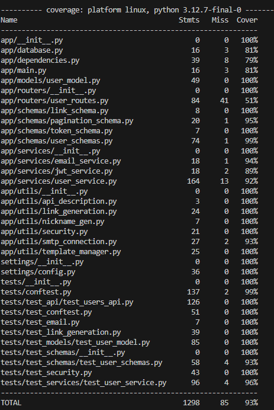
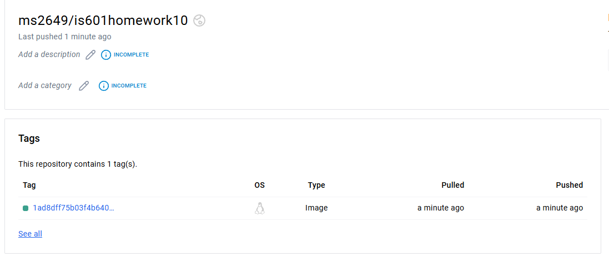

# Event Manager Company: Software QA Analyst/Developer Onboarding Assignment
## Issues

1. **Username validation**: [Link](https://github.com/Mike-Sudol/is601homework10/issues/8) 
Currently we only check if the email is unique when registering, we need to check if the username is as well

2. **Add UserIDs to testing**: [Link](https://github.com/Mike-Sudol/is601homework10/issues/4) 
Our current test schema is using string for ids, we should be using uuid

3. **Password validation**[Link](https://github.com/Mike-Sudol/is601homework10/issues/2):
Were not sufficiently validating our passwords, we need to add some extra precautions
   

4. **Email validation**: [Link](https://github.com/Mike-Sudol/is601homework10/issues/10) 
We need to better check if our emails are valid before we pass them on

5. **Access Tokens**: [Link](https://github.com/Mike-Sudol/is601homework10/issues/1) 
Our tests don't have the access tokens they need to run the tests

## Pytest Coverage

## What I Learned
The project emphasized the critical importance of thorough testing and systematic problem-solving. By meticulously examining the user lifecycle on the localhost, and also on the admin side, I was able to identify and address various issues, which not only improved the application's functionality but also enhanced my own technical skills. Each challenge became an opportunity to develop new functions or creatively repurpose existing ones, pushing me to think more critically about code design and implementation.

A really interesting aspect of the project was working with Docker and understanding the microservices architecture. Seeing how different services communicate internally and troubleshooting connectivity issues provided invaluable insights into how modern software works. Tools like pgAdmin and curl became crucial in navigating and resolving internal network configurations.

The importance of comprehensive testing cannot be overstated. Running pytest after every change became a crucial habit, allowing me to catch and address bugs early in the development process. Running each failing test in isolation allowed to fixate on a particular problem and fix them one by one. This approach not only improved the code's reliability but also made debugging significantly more straightforward. Additionally, setting up a robust linter proved instrumental in maintaining code quality, providing immediate feedback on potential issues and ensuring adherence to best practices.

Equally crucial was the process of thoroughly reading and understanding project documentation. Carefully reviewing the instructor's guidelines, videos, and project readme multiple times helped ensure that I was meeting all project requirements and staying aligned with the intended objectives.

## Dockerhub Link
[Link to project image deployed to Dockerhub](https://hub.docker.com/repository/docker/ms2649/is601homework10/general)

